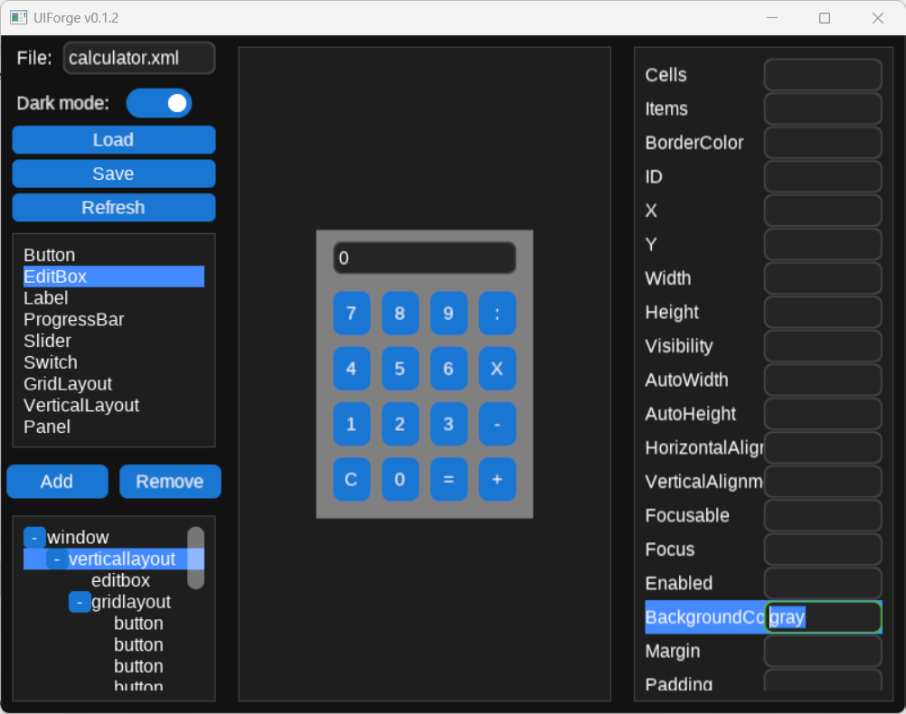
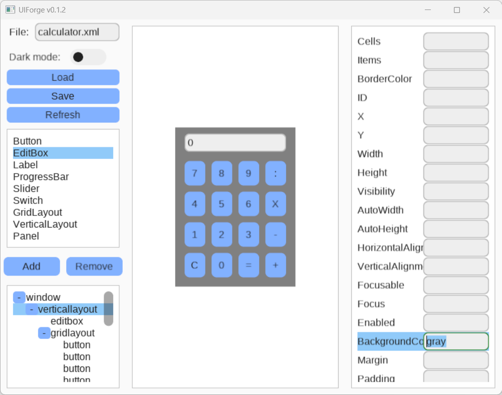

# UISharp
A simple, cross-platform UI framework written in C# designed for small to mid-size projects, especially indie developers.  
UISharp is currently a minimal viable product (MVP), and will be continuously expanded with new features, optimizations, and code cleanup.

---

## Table of Contents

- [Features](#features)
- [UIForge: The UISharp Editor](#uiforge-the-uisharp-editor)
- [Example](#example)
  - [XML UI Definition](#xml-ui-definition)
  - [C# Program Entry Point](#c-program-entry-point)
  - [Window Code Behind](#window-code-behind)
- [Branching Strategy](#branching-strategy)
- [Design Choices](#design-choices)
- [Glossary](#glossary)
- [UI Class Hierarchy](#ui-class-hierarchy)

## Features

1. WPF-inspired UI development with simplified architecture. Supports UI creation directly in C# (like WinForms) or with a custom XML UI definition language.
2. Uniform binding: Every UI property (e.g., size, location, color) is wrapped into a `UIProperty<T>` class to enable data binding and change notifications.
3. Cross-platform support for Windows, Linux, and (untested) macOS.
4. Comes with a visual editor, **UIForge**, that auto-generates XML UI definitions.
5. Built on OpenGL for rendering and SDL for input/events. Low-level systems are wrapped in interfaces, enabling mock testing and alternate backends like Vulkan or DirectX.
6. Integrates well with OpenGL-powered applications, allowing game scenes or 3D animations as part of the UI.
7. Designed for efficient retained-mode rendering using OpenGL instancing (WIP). Shapes are drawn as VAOs; instance rendering and batching will follow.

## UIForge: the UISharp Editor

UIForge is a visual editor for UISharp’s XML UI definitions. Although in early MVP stage, it enables fast prototyping and visual editing.

**Dark Theme Preview:**



**Light Theme Preview:**



UISharp and UIForge support customizable themes and allows developers to add or create new themes easily.

## Example

### XML UI Definition

Example of a calculator UI, auto-generated by UIForge:

```xml
<?xml version="1.0" encoding="utf-8"?>
<window id="calculatorWindow" width="800" height="600">
    <verticallayout backgroundcolor="gray">
        <editbox text="0" margin="10;0;0;0" width="162" />
        <gridlayout rows="4" columns="4" autowidth="wrap" margin="10">
            <button id="button7" text="7" padding="10" margin="5" />
            <button id="button8" text="8" margin="5" padding="10" />
            <button id="button9" text="9" margin="5" padding="10" />
            <button id="buttonColon" text=":" margin="5" padding="10" />
            <button id="button4" text="4" margin="5" padding="10" />
            <button id="button5" text="5" margin="5" padding="10" />
            <button id="button6" text="6" margin="5" padding="10" />
            <button id="buttonTimes" text="X" margin="5" padding="10" />
            <button id="button1" text="1" margin="5" padding="10" />
            <button id="button2" text="2" margin="5" padding="10" />
            <button id="button3" text="3" margin="5" padding="10" />
            <button id="buttonMinus" text="-" margin="5" padding="10" />
            <button id="buttonCancel" text="C" margin="5" padding="10" />
            <button id="button0" text="0" margin="5" padding="10" />
            <button id="buttonEquals" text="=" margin="5" padding="10" />
            <button id="buttonPlus" text="+" margin="5" padding="10" />
        </gridlayout>
    </verticallayout>
</window>
```

### C# Program Entry Point

```csharp
internal class Program
{
    static void Main(string[] _)
    {
        using var application = new Application();
        application.Logger.Verbosity = Verbosity.Verbose;
        application.ApplicationStarted += (_, _) => LoadMain(application);
        application.Run();
    }

    private static void LoadMain(Application application)
    {
        application.ShowWindow<CalculatorWindow>();
    }
}
```

### Window Code Behind

Binding in xml UI definitions will eventually eliminate the need for code-behind, but this is the current structure:

```csharp
internal class CalculatorWindow : Window
{
    private readonly Button _button1;
    private readonly Button _button2;

    public MainWindow(Application parent,
                      Button button1, // The button with id "button1" will be automatically injected here
                      Button button2, /*etc.*/) : base(parent)
    {
        _button1 = button1;
        _button2 = button2;
        // etc.

        _button1.Action += () => {}; //etc._
    }
}
```

## Branching Strategy

The branches are as follows:
- `main`: automatic releases and tagging using semantic version. Branch directly from `main` for hot fixes and squash merge.
Later on move to GitFlow.
- `feature/*`: feature branches to merge into release branches.
- `bugfix/*`: critical bug fixes, usually branched to and from `main` directly.
- Other (enhancement, pipeline, etc.): other branches usually branched from and to release branches.

*Branch name*: type/issue number-description
*Commit name*: type #issue number: message

for example
- feature/100-add-button
- refactoring/47-rendering-engine-cleanup
- bugfix/50-fix-issue
- release/v1.0.0

and commits

"Feature #100: fixed issue"
"Refactoring #47: it looks better!"
"Bug #50: it now works!"

pull request messages

"Fixes #100" or "Closes #100" or "Resolves #100" so that pull request merging automatically closes issues.
"References #100" to link issue to PR.
DO NOT add these statements in the PR messages or commit messages because they cause confusion. Add them in the description of PRs.

## Design choices
- Do not support backward compatibility because it prevents flexibility
- UIForge detects the current referenced UISharp version in the target C# project and runs upgrade scripts if necessary, upgrading the project dependency version and all the UIDefinition files.

## Glossary

- Component children
  - Canvas (list of shapes)
  - Children (private children directly mapped to UI tree). When deriving a UIObject to not mess up with children unless necessary.
  - Items or Item (logical children or child for layout etc.)
  - Overlays (rendered after Children, they do not contribute to layout calculation so they are separated from Children)
- Binding
  - Two ways, source to destination, destination to source
  - Binding source, binding destination
  - Binding origin, binding target
  - Shallow binding vs deep binding
- Rendering
  - Retained mode
  - Invalidation
  - Render instancing
- Component hierarchy
  - UIComponent
  - UIRoot
  - containers (single and multiple and hierarchical)
- UIDefinition language EAML language

## UI Class Hierarchy

UIObject  
├── UISurface  
│   └── (Base class for windows, maybe activities in the future)  
├── UIElement  
│   └── (Base class for each window's children)  
│  
│   └── UIControl  
│       └── (Base class for all controls like buttons, layouts, etc.)  
│  
│       ├── UISingleContainer  
│       │   └── (Controls with one item)  
│       ├── UIContainer  
│       │   └── (Controls with an Items property to add children, e.g. layouts, collections)  
│       └── UIHierarchicalContainer  
│           └── (Controls with hierarchical Items)  
│  
UIOverlay  
└── (Base class for all overlays like popups, tooltips, etc. Cannot be inserted as Items in windows or layouts)  