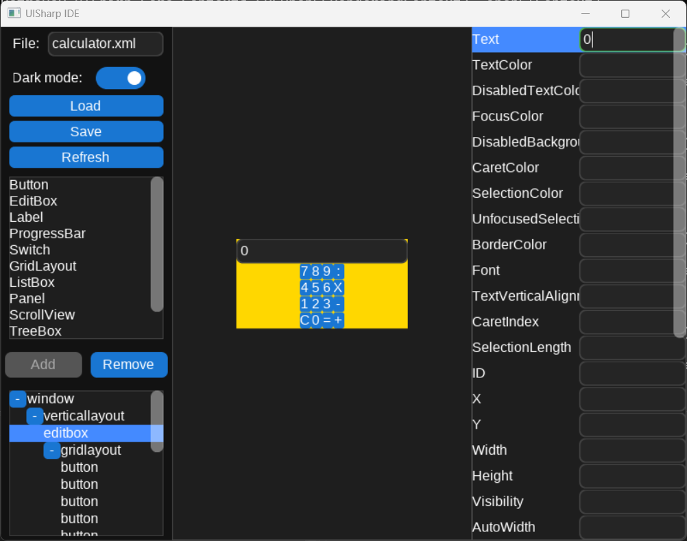

# UISharp
This is a new cross-platform project written in C#.
The project has just started so expect a lot of updates to the readme file and to the framework in the future!
The active branch will be "mvp", which will be further merged into main.

The main goal is
1. Allow using OpenGL and svg vector graphics (efficient, high quality, support for 3d rendering)
2. Allow flexible UI (dynamically load xml UI similar to WPF XAML but more simple)
3. Simplicity for medium size projects (easier than WPF)
4. Cross platofrm (Window, mac, linux)
5. Testable (create UI integration tests)

# UISharp IDE
The UISharp library comes with a IDE application, which is a UI designer to define your xml definition file visually.
This is still a small mvp, the UI will significantly improve later.

# General Guidelines
The branches are as follows:
- `main`: automatic releases and tagging using semantic versioning. Branch directly from `main` for hot fixes and squash merge.
- `release/*`: big work will go into release branch first and then merged to `main` without squashing, to preserve feature history.
- `feature/*`: feature branches to merge into release branches.
- `bugfix/*`: critical bug fixes, usually branched to and from `main` directly.
- Other (enhancement, pipeline, etc.): other branches usually branched from and to release branches.

For now, create beta versions before release in release branches to test. Once stable, merge to main and release.

*Branch name*: type/issue number-description
*Commit name*: type #issue number: message

for example
- feature/100-add-button
- refactoring/47-rendering-engine-cleanup
- bugfix/50-fix-issue
- release/v1.0.0

and commits

"Feature #100: fixed issue"
"Refactoring #47: it looks better!"
"Bug #50: it now works!"

pull request messages

"Fixes #100" or "Closes #100" or "Resolves #100" so that pull request merging automatically closes issues.
"References #100" to link issue to PR.
DO NOT add these statements in the PR messages or commit messages because they cause confusion. Add them in the description of PRs.

# Main Design choices
- Do not support backward compatibility because it prevents flexibility
- UISharp.IDE detects the current referenced UISharp version in the target C# project and runs upgrade scripts if necessary, upgrading the project dependency version and all the UIDefinition files.